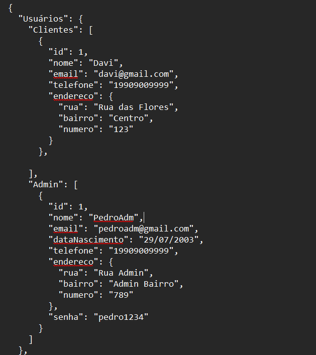
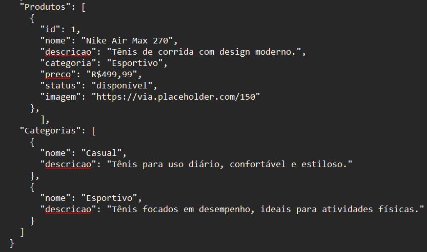

# SneakerHeads  
## Apresentação do Sistema - Loja de Tênis
O sistema de loja de tênis foi desenvolvido para atender à demanda de venda de tênis online, com foco na simplicidade, organização e eficiência. O sistema é composto por um back-end que gerencia dados de usuários, produtos e categorias, e um front-end que proporciona uma experiência interativa para os clientes. A seguir, apresentamos as principais funcionalidades e características deste sistema. 

### Gestão de Usuários
O sistema permite o cadastro e a gestão de dois tipos de usuários:
#### Clientes:
Os clientes podem visualizar e comprar os produtos disponíveis na loja, consultar detalhes sobre cada item, como nome, descrição, preço, categoria e disponibilidade.
#### Administradores:
Os administradores têm permissões para adicionar, editar ou remover produtos da loja. Eles também podem gerenciar informações sobre os clientes, como endereços e dados pessoais, além de controlar a disponibilidade dos itens no estoque.
#### Sistema de Estoque:
O sistema mantém um controle simples de status de disponibilidade dos tênis. Quando um produto está disponível no estoque, ele é marcado como disponível; caso contrário, é marcado como indisponível, o que impede os clientes de comprá-lo até que o estoque seja reposto.
#### Interface Simples e Intuitiva:
O front-end foi desenvolvido para ser simples e fácil de usar. A interface permite que os clientes visualizem os produtos de maneira clara e intuitiva, com informações como nome, preço e imagem do produto. Além disso, o design responsivo garante uma boa experiência em dispositivos móveis e desktops.

### Tecnologias Utilizadas
#### Back-End: 
Desenvolvido com PHP, garantindo eficiência para manipulação de dados.
#### Front-End: 
Utiliza HTML, CSS e JavaScript para uma interface limpa e interativa, com requisições dinâmicas para exibir os produtos disponíveis.
#### Banco de Dados: 
A estrutura de dados foi modelada em formato JSON no MongoDB ou SQL no Postgress, facilitando o gerenciamento das informações de usuários, produtos e categorias.

### Exemplo Collection Aninhada Json

